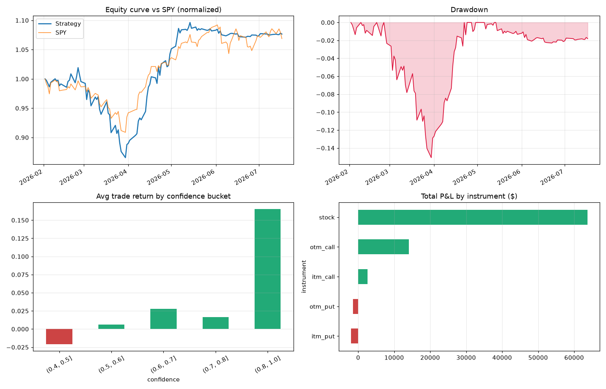

# Motley Fool article-sentiment backtest — results

Cohort: articles published 2026-02-01 to 2026-04-30; simulation 2026-02-02 to 2026-07-17 on $1,000,000 starting capital.

| Metric | Value |
|---|---|
| start | 2026-02-02 |
| end | 2026-07-17 |
| final_equity | 1077149.0 |
| total_return | 0.0771 |
| annualized | 0.1788 |
| sharpe | 1.05 |
| max_drawdown | -0.1507 |
| spy_return_same_period | 0.0689 |
| n_trades | 639 |
| win_rate | 0.368 |
| avg_win | 1238.0 |
| avg_loss | -530.0 |
| profit_factor | 1.36 |

## By direction

| direction | n | total_pnl | win_rate | avg_ret |
|---|---|---|---|---|
| bearish | 51 | -6164.29 | 0.275 | -0.075 |
| bullish | 588 | 83188.44 | 0.376 | 0.027 |

## By instrument

| instrument | n | total_pnl | win_rate | avg_ret |
|---|---|---|---|---|
| itm_call | 2 | 2569.25 | 0.5 | 0.367 |
| itm_put | 3 | -2036.94 | 0.0 | -0.498 |
| otm_call | 14 | 14134.07 | 0.286 | 0.29 |
| otm_put | 3 | -1400.14 | 0.0 | -0.373 |
| stock | 617 | 63757.91 | 0.373 | 0.016 |

## By confidence

| confidence | n | total_pnl | win_rate | avg_ret |
|---|---|---|---|---|
| (0.4, 0.6] | 210 | 431.5 | 0.352 | -0.002 |
| (0.6, 0.8] | 415 | 64456.02 | 0.376 | 0.025 |
| (0.8, 1.0] | 13 | 12314.04 | 0.385 | 0.165 |

## By risk

| risk | n | total_pnl | win_rate | avg_ret |
|---|---|---|---|---|
| (0, 3] | 212 | 14822.08 | 0.368 | 0.009 |
| (3, 6] | 290 | 33823.83 | 0.362 | 0.016 |
| (6, 10] | 137 | 28378.24 | 0.38 | 0.04 |

## Top 10 trades

| ticker   | direction   | instrument   | entry_date          | exit_date           |      pnl |    ret | exit_reason   |
|:---------|:------------|:-------------|:--------------------|:--------------------|---------:|-------:|:--------------|
| MU       | bullish     | otm_call     | 2026-04-10 00:00:00 | 2026-05-15 00:00:00 | 13857.1  | 2.0683 | trailing_stop |
| MU       | bullish     | otm_call     | 2026-03-30 00:00:00 | 2026-05-12 00:00:00 | 12466.8  | 2.4805 | trailing_stop |
| MRVL     | bullish     | otm_call     | 2026-04-27 00:00:00 | 2026-06-05 00:00:00 |  5189.33 | 2.5497 | trailing_stop |
| GOOGL    | bullish     | itm_call     | 2026-04-13 00:00:00 | 2026-06-01 00:00:00 |  4754.9  | 1.2985 | trailing_stop |
| MU       | bullish     | stock        | 2026-03-30 00:00:00 | 2026-05-15 00:00:00 |  4320.38 | 0.6294 | trailing_stop |
| AMD      | bullish     | stock        | 2026-02-19 00:00:00 | 2026-05-15 00:00:00 |  4113.29 | 0.6392 | trailing_stop |
| MU       | bullish     | stock        | 2026-03-31 00:00:00 | 2026-05-12 00:00:00 |  3932.75 | 0.6875 | trailing_stop |
| MU       | bullish     | stock        | 2026-03-26 00:00:00 | 2026-05-15 00:00:00 |  3893.09 | 0.605  | trailing_stop |
| AMD      | bullish     | stock        | 2026-02-09 00:00:00 | 2026-05-06 00:00:00 |  3591.13 | 0.5979 | time_stop     |
| MU       | bullish     | stock        | 2026-04-01 00:00:00 | 2026-05-15 00:00:00 |  3415.63 | 0.6824 | trailing_stop |

## Worst 10 trades

| ticker   | direction   | instrument   | entry_date          | exit_date           |      pnl |     ret | exit_reason   |
|:---------|:------------|:-------------|:--------------------|:--------------------|---------:|--------:|:--------------|
| SNDK     | bullish     | otm_call     | 2026-02-17 00:00:00 | 2026-03-06 00:00:00 | -7336.23 | -0.4318 | trailing_stop |
| ASML     | bullish     | otm_call     | 2026-02-17 00:00:00 | 2026-03-03 00:00:00 | -3520.39 | -0.2755 | trailing_stop |
| MU       | bullish     | otm_call     | 2026-02-19 00:00:00 | 2026-03-03 00:00:00 | -2612.49 | -0.4116 | trailing_stop |
| NVDA     | bullish     | itm_call     | 2026-02-23 00:00:00 | 2026-02-27 00:00:00 | -2185.65 | -0.5637 | trailing_stop |
| MU       | bullish     | otm_call     | 2026-02-27 00:00:00 | 2026-03-06 00:00:00 | -2081.79 | -0.4096 | trailing_stop |
| NVDA     | bullish     | otm_call     | 2026-02-02 00:00:00 | 2026-02-04 00:00:00 | -1805.4  | -0.4795 | trailing_stop |
| DUOL     | bullish     | stock        | 2026-02-04 00:00:00 | 2026-03-04 00:00:00 | -1267.95 | -0.197  | trailing_stop |
| AMD      | bullish     | stock        | 2026-02-02 00:00:00 | 2026-02-04 00:00:00 | -1222.07 | -0.1526 | trailing_stop |
| LLY      | bullish     | stock        | 2026-02-24 00:00:00 | 2026-03-17 00:00:00 | -1129.94 | -0.1097 | trailing_stop |
| MSFT     | bullish     | stock        | 2026-03-17 00:00:00 | 2026-03-26 00:00:00 | -1101.34 | -0.0875 | trailing_stop |
