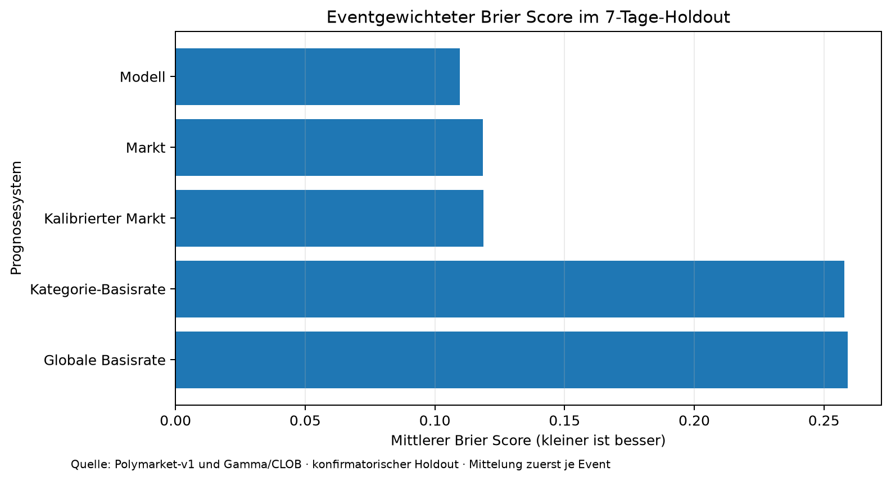
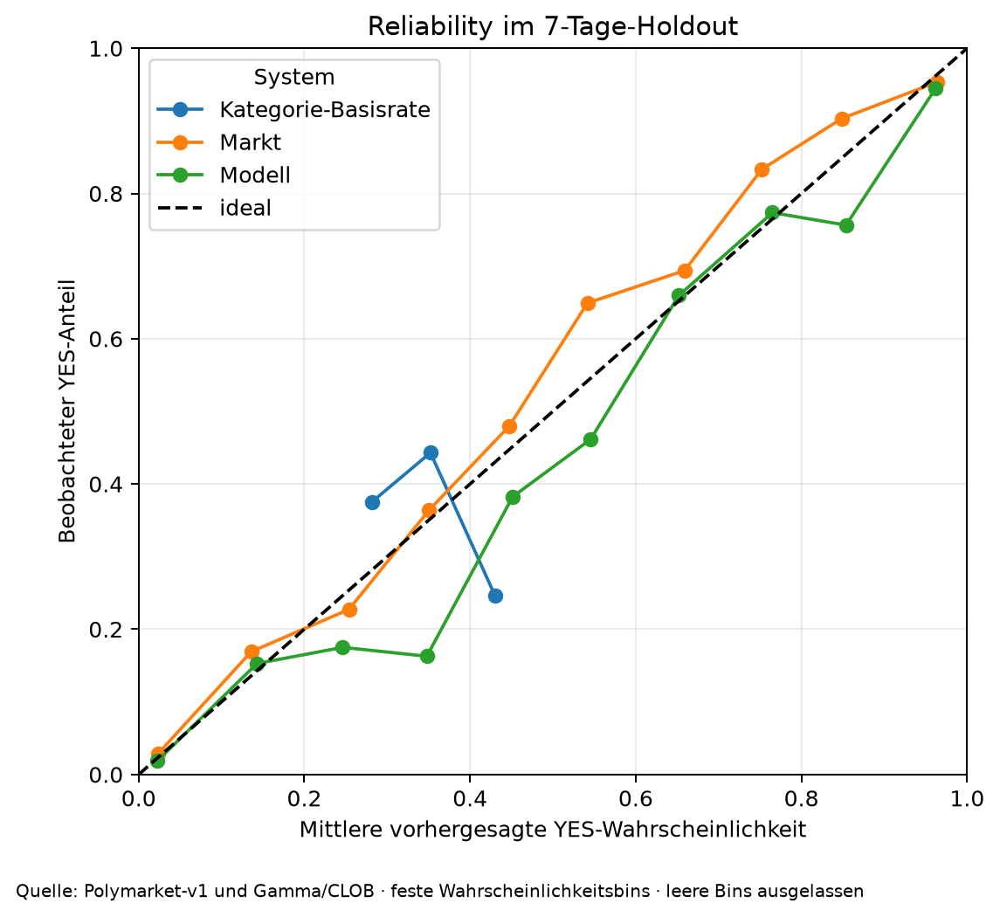
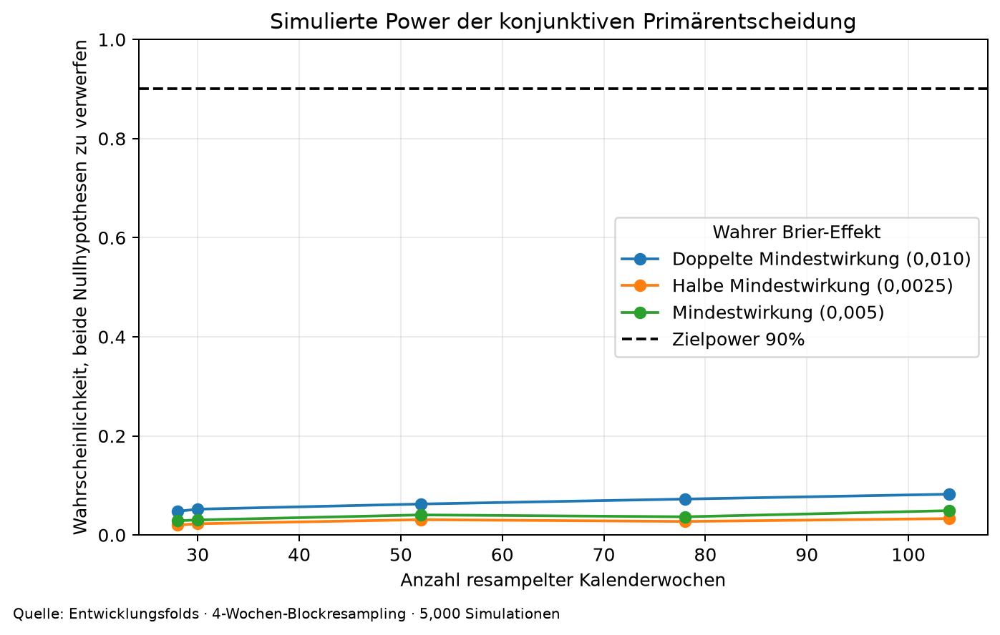

# Vorhersage binärer Polymarket-Verträge

## Abstract

Diese Arbeit prüft, ob ein datengetriebenes Modell den Ausgang binärer
Polymarket-Verträge sieben Tage vor dem zugrunde liegenden Ereignis besser
prognostiziert als der zeitgleiche Marktpreis und eine ausschließlich aus der
Vergangenheit geschätzte Basisrate. Die Studie verwendet einen
ereignisgruppierten, chronologischen Walk-forward-Entwurf, sperrt die
Modellauswahl vor dem Holdout und bewertet Wahrscheinlichkeiten primär mit dem
Brier Score. Im konfirmatorischen Holdout liegen
889 Verträge aus
675 Eventgruppen und 30
Kalenderwochen vor. Gewählt wurde `ensemble`.

Der eventgewichtete Brier Score beträgt
0,1097 für das Modell,
0,1185 für den Markt und
0,2578 für die Kategorie-Basisrate.
Die konjunktive Nullhypothese wird nicht verworfen. Unter diesem Design gibt es keine ausreichende Evidenz, dass das gesperrte Modell sowohl den Markt als auch die historische Basisrate übertrifft. Diese Aussage betrifft Forecast Skill, nicht handelbare Rendite.

## 1. Motivation und Forschungsfrage

Prognosemärkte aggregieren verteilte Information, können aber durch geringe
Liquidität, Herdenverhalten, emotionale Reaktionen, Plattformregeln und
regulatorische Zugangsbarrieren verzerrt werden. Die zentrale Frage lautet:

> Verbessert ein ausschließlich mit damals verfügbaren Daten trainiertes Modell
> die probabilistische Vorhersage späterer binärer Vertragsausgänge gegenüber
> sinnvollen, zeitgleichen Baselines?

„Zukunft vorhersagen“ wird hier eng und überprüfbar definiert: geringerer
Out-of-sample-Verlust auf späteren, während der Modellauswahl unangetasteten
Events. Eine wirtschaftliche Handelsstrategie ist nicht Gegenstand des
Primärtests.

## 2. Mathematischer Hintergrund

Für Ergebnis \(Y\in\{0,1\}\) und Prognose \(p\in[0,1]\) gilt

\[
BS(p,Y)=(p-Y)^2.
\]

Der Brier Score ist ein *proper scoring rule*: Im Erwartungswert wird eine
ehrliche Wahrscheinlichkeit belohnt. Analysis tritt in der logistischen
Abbildung

\[
\operatorname{logit}(p)=\log\frac{p}{1-p}
\]

und in der Optimierung differenzierbarer Verlustfunktionen auf. Integralideen
erscheinen als Erwartungswerte über die unbekannte Ergebnisverteilung;
empirisch werden sie durch Mittelwerte und Resampling approximiert.

Der Vergleichseffekt ist

\[
\Delta_b=E_g[\,BS(p_b,Y)-BS(p_M,Y)\,],
\]

wobei zuerst innerhalb zusammengehöriger Verträge und dann gleichgewichtet
über Events \(g\) gemittelt wird. Positive Werte sprechen für das Modell.

## 3. Forschungsstand

Der detaillierte Review steht in
[`docs/literature_review.md`](../docs/literature_review.md). OpenMarket,
ForecastBench, EventFactorBench und Outcome-RL zeigen gemeinsam, dass
zeitliche Splits, matched-time Marktbaselines und veröffentlichte
Nullresultate unverzichtbar sind. Polymarket-v1 und Mikrostrukturarbeiten
zeigen, dass API-Snapshots, Fills und Orderbücher nicht gleichgesetzt werden
dürfen. Domain-spezifische Kalibrationsstudien motivieren Kategorie- und
Horizontanalysen, aber keine nachträgliche Auswahl günstiger Subgruppen.

## 4. Daten und Speicherung

Der Collector hat 2500 Gamma-Zeilen abgerufen,
1321 binäre Märkte normalisiert und
21037 CLOB-Preispunkte gespeichert.
2419 Ausschlussprotokolle wurden erzeugt.
Nach Horizont- und Zeitprüfung enthält die Gesamtkohorte
6015 Markt-Horizont-Zeilen; davon
1046 am 7-Tage-Horizont. Die Gesamtkohorte kombiniert
5876 gepinnte
Polymarket-v1-Zeilen mit 139
Gamma/CLOB-V2-Zeilen.

Die historische Quelle umfasst
849 tägliche Parquets
(12,26 GiB) der exakt gepinnten Revision
`5aa1b9d52316a8b2e789e81c8ae42c7ed532e8aa`. Im Holdout stammen
826 Zeilen aus
der chain-ausgerichteten V1-Schicht und
63 aus der
Gamma/CLOB-V2-Schicht.

Rohantworten wurden unter Run-ID `real-20260910-v2` mit URL, Parametern,
UTC-Abrufzeit und SHA-256 gespeichert. Normalisierte Parquets und eine
DuckDB-Datei trennen `markets`, `events`, `price_points`, `resolutions`,
`provenance` und `exclusions`. Große Rohdaten sind nicht Teil von Git. Das
vollständige Schema und die Leakage-Klassifikation stehen in
[`docs/data_dictionary.md`](../docs/data_dictionary.md).

Wichtig: terminales Volumen, terminale Liquidität und Gewinnerfelder sind
keine Modellmerkmale. Preise müssen am oder vor dem individuellen Cutoff
liegen und höchstens 6 Stunden alt
sein.

Für V1 ist die Marktbaseline der letzte normalisierte On-chain-Trade
(`p_event`) vor dem Cutoff; für V2 ist sie der letzte CLOB-Historienpunkt.
Mangels separatem V1-Eventstart wird dort der frühere Zeitpunkt aus
`close_at` und `resolved_at` als retrospektiver Anker verwendet. Diese
Quellen- und Ankerheterogenität ist eine zentrale Generalisierungsgrenze.

## 5. Hypothesen

Für Markt \(P\) und Kategorie-Climatology \(C\) wurden vorab definiert:

\[
H_{0P}:\Delta_P\le0,\quad H_{0C}:\Delta_C\le0.
\]

Das Signifikanzniveau ist \(\alpha=0,05\).
Die globale Behauptung verlangt die Verwerfung beider Nullhypothesen; ihr
p-Wert ist daher \(\max(p_P,p_C)\). Die minimale praktisch relevante
Brier-Verbesserung ist
0,005.
`P0 < 0,05` wäre keine korrekte Schreibweise: \(H_0\) bezeichnet die
Nullhypothese, \(\alpha\) den Schwellenwert und \(p\) den berechneten
p-Wert.

## 6. Modelle und Experiment

Die Entwicklung verglich regularisierte Text-/Metadaten-Logistik,
Gradient Boosting, ein Markt-Residualmodell mit festem Markt-Logit-Offset und
ein validierungsgewichtetes Ensemble. Die Entwicklungssieger-Konfiguration
`ensemble` erzielte einen eventgewichteten
Validierungs-Brier von
0,1251. Für die finale
Anpassung standen 155 Zeilen zur Verfügung;
erst danach wurde der Holdout ausgewertet.

Der Split ist eventgruppiert. Für jeden Validierungsfold durften nur Labels
verwendet werden, die mindestens 30 Tage vor dem
ersten Validierungscutoff bereits aufgelöst waren. Vorverarbeitung,
Textvektorisierung, Imputation und Kalibration wurden pro Fold neu angepasst.

## 7. Primärresultat

Modell gegen Markt:

- mittlere Brier-Verbesserung:
  0,0089
- einseitiger p-Wert: 0,0530
- einseitige 95%-Untergrenze:
  0,0020
- Brier Skill Score: 0,0747

Modell gegen Kategorie-Basisrate:

- mittlere Brier-Verbesserung:
  0,1481
- einseitiger p-Wert: 0,0001
- einseitige 95%-Untergrenze:
  0,1289
- Brier Skill Score: 0,5746

Der globale Intersection-Union-p-Wert beträgt
0,0530. Die konjunktive Nullhypothese wird nicht verworfen. Unter diesem Design gibt es keine ausreichende Evidenz, dass das gesperrte Modell sowohl den Markt als auch die historische Basisrate übertrifft.

Der beobachtete Marktvergleich von
0,0089 liegt zwar über der
Mindestwirkung von
0,0050, aber seine
einseitige 95%-Untergrenze von
0,0020 nicht. Zudem liegt
der nullzentrierte Bootstrap-p-Wert mit
0,0530 knapp über \(\alpha\). Das
präregistrierte Kriterium verlangt beides und bleibt daher unerfüllt. Die
Abweichung zwischen Perzentilintervall und nullzentriertem Test ist bei der
schiefen, stark nach Wochen variierenden Bootstrap-Verteilung möglich; die
Entscheidungsregel wird nicht nachträglich geändert.

Bei Vertragsgewichtung statt gleicher Eventgewichtung fällt die
Marktverbesserung auf
0,0032. Das zeigt, dass
die positive Primärdifferenz nicht über alle Einzelverträge gleichmäßig ist.





## 8. Power, Robustheit und Sekundäranalysen

Die simulierte Power erreicht im untersuchten Wochenraster nicht 90% bei der Mindestwirkung. Beim Rasterpunkt von 30 Wochen beträgt die geschätzte gemeinsame Power nur 3,0 %; Grundlage sind 28 beobachtete OOF-Wochen. Mit 30 effektiven Holdout-Wochen ist die präregistrierte Mindestzahl zeitlicher Einheiten erreicht.



Die Blocklängen-Sensitivität wurde für
2, 8, 13
Wochen berechnet. Die Markt-p-Werte liegen dabei zwischen
0,0671 und
0,1525; keine alternative Blocklänge
ändert die Primärentscheidung.

Die gesperrte Modellfamilie erreicht in der Refit-Ablation einen Brier Score
von 0,1097. Ohne Text steigt er auf
0,1138, ohne Preisverlauf auf
0,1126 und ohne Kategorie
auf 0,1099. Diese Werte sind
diagnostisch und keine neuen Primärtests. Weitere vorab benannte Prüfungen umfassen nur
CLOB-Winner-Labels, den Ausschluss von NegRisk-Verträgen, das Entfernen der
größten Eventgruppe, Vertragsgewichtung und Modellablationen. Die
maschinenlesbaren Resultate liegen in [`reports/results`](results/).

Sekundäre Horizonte:

- 30 Tage: Modell `market_residual_c0.1`, 308 Events, globaler Holm-korrigierter p-Wert 1,0000.
- 1 Tag: Modell `market_residual_c0.1`, 2247 Events, globaler Holm-korrigierter p-Wert 1,0000.

Subgruppenresultate in `slice_metrics.csv` sind deskriptiv. Sie dürfen nicht
als neue konfirmatorische Hypothesen interpretiert werden.

## 9. Limitationen

1. Die Studie ist ein retrospektiver, zeitgerechter Backtest und keine
   vollständig prospektive Vorhersagekampagne.
2. Die CLOB-Preishistorie ist gesampelt und enthält kein vollständiges
   historisches Orderbuch.
3. V1 nutzt den letzten On-chain-Trade, V2 einen CLOB-Historienpunkt. Diese
   Baselines sind beide zeitgerecht, aber mikrostrukturell nicht identisch.
4. Der V1-Anker `min(close_at, resolved_at)` ist rückblickend bekannt. Er
   verhindert Outcome-Leakage in den Merkmalen, bildet aber keine vollständig
   prospektiv planbare Deadline ab.
5. Gamma-Metadaten können nachträglich aktualisiert worden sein. Der
   textfreie Robustheitstest reduziert, beseitigt aber nicht jede
   Quellenunsicherheit.
6. V2-Verträge desselben Gamma-Events werden gruppiert. Für V1 rekonstruiert
   eine konservative Kombination aus Kategorie, Enddatum und bereinigtem Slug
   logische Familien; weiter entfernte Abhängigkeiten können verbleiben.
7. Ein Brier-Vorteil garantiert nach Spread, Gebühren, Slippage und Latenz
   keinen Handelsgewinn.
8. Ein Foundation-Model wurde bewusst nicht als konfirmatorische Komponente
   eingesetzt, um schwer prüfbare Trainingsdatenkontamination zu vermeiden.
9. Trotz 675 Holdout-Events schätzt die Entwicklungs-Simulation bei der
   kleinen Mindestwirkung nur geringe Power; 155 finale Trainingszeilen
   begrenzen außerdem die Modellstabilität.
10. API-Lücken und strenge Frischekriterien reduzieren die effektive
   Stichprobe. Power und Konfidenzintervalle sind deshalb entscheidender als
   die bloße Vertragsanzahl.

## 10. Schlussfolgerung

Die konjunktive Nullhypothese wird nicht verworfen. Unter diesem Design gibt es keine ausreichende Evidenz, dass das gesperrte Modell sowohl den Markt als auch die historische Basisrate übertrifft.

Deskriptiv ist das Ensemble klar besser als die Basisrate und um
0,0089 Brier-Punkte besser
als der Markt. Konfirmatorisch scheitert gerade der schwierigere
Marktvergleich mit \(p=0,0530\)
knapp am vorab gesetzten Niveau und sichert die praktische Mindestwirkung
nicht ab. Die Forschungsfrage wird daher mit „vielversprechender Effekt,
aber noch kein belastbarer Nachweis gegenüber dem Markt“ beantwortet.

Die fachlich zulässige Aussage ist auf die dokumentierte Population, den
7-Tage-Horizont, den Daten-Cutoff und den gesperrten Modellprozess begrenzt.
Ein nicht signifikantes Resultat beweist nicht \(H_0\); es zeigt fehlende
Evidenz unter der erreichten Power. Der stärkste nächste Test wäre eine
zweite, vorab timestamped prospektive Kohorte ohne erneute Modellauswahl.

## 11. Reproduzierbarkeit

Ein zweiter unabhängiger Trainings- und Evaluationslauf (`study-reproduction-20260910`) aus demselben unveränderlichen Daten-Run reproduzierte Primärtest, Holdout-Prognosen, Modellwahl, Scores, Power und Sekundäranalysen exakt.

```bash
python3 -m venv .venv
.venv/bin/pip install -r requirements.lock
.venv/bin/pip install -e . --no-deps

# Gesamter Online-Lauf
.venv/bin/polymarket-study run --config configs/study.yaml

# Oder getrennte, auditierbare Schritte
.venv/bin/polymarket-study collect
.venv/bin/polymarket-study build-dataset
.venv/bin/polymarket-study train
.venv/bin/polymarket-study evaluate
.venv/bin/polymarket-study report

# Qualitätsgates
.venv/bin/ruff check .
.venv/bin/mypy src
.venv/bin/pytest
```

Konfiguration: `5dea8ded67b29751daf4a7ca3f186c0dc320e8e6449b9ed94a10127469ede823`
Daten-Run: `real-20260910-v2`
Studien-Run: `study-reproduction-20260910`
